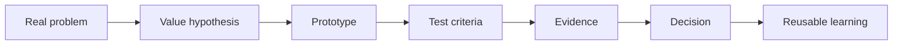

# Carlos Icaro Kauã

**Computer Engineering + Mechatronics applied to products that move from idea to working prototype.**

  
  
  
  

  

  
  

---

## What I bring to the table

I build at the intersection of **software, mechatronics, AI and product thinking**. My strongest value is connecting messy real-world problems to testable solutions: framing the problem, building the prototype, documenting the decision path and learning from the result.

| Signal | How it becomes value |
| --- | --- |
| **Computer Engineering at Inteli** | Product-minded engineering, agile delivery, systems thinking and collaborative projects. |
| **Certified Mechatronics Technician at FMM-AM** | Physical prototyping, embedded systems, automation, sensors, actuators and hardware constraints. |
| **Applied AI and software experiments** | Computer vision, AI-assisted workflows, full-stack interfaces and data-driven validation. |
| **Documentation discipline** | READMEs, decision logs, acceptance criteria and reusable playbooks that make work easier to audit and improve. |

## Featured work

| Project | What it shows | Stack / domain |
| --- | --- | --- |
| [Vidratus](https://github.com/C-Icaro/Vidratus) | Sustainability project: glass-shredding machine with bagging system, from concept to prototype narrative. | Hardware, product design, HTML |
| [arduino-mecatronica-fmm](https://github.com/C-Icaro/arduino-mecatronica-fmm) | Arduino/ESP32 portfolio with IoT, home automation, electronic scoreboards, weather stations and Factory.io simulations. | C++, Arduino, IoT, automation |
| [HackCafe](https://github.com/C-Icaro/HackCafe) | Hackathon solution built under delivery pressure, connecting product framing and implementation. | TypeScript, web product |
| [desafio-legitimuz-where-is-waldo-wally](https://github.com/C-Icaro/desafio-legitimuz-where-is-waldo-wally) | Image-processing challenge focused on detection, search and practical computer vision reasoning. | Python, computer vision |
| [desktop_app_for_music_learning](https://github.com/C-Icaro/desktop_app_for_music_learning) | Desktop learning experience that combines interface design and educational product thinking. | TypeScript, desktop app |
| [Computing-Engineering-Bachelor](https://github.com/C-Icaro/Computing-Engineering-Bachelor) | Public trail of engineering studies, notebooks and technical practice. | Jupyter Notebook, engineering |

> Quick read: the public portfolio already spans physical products, embedded systems, software interfaces, computer vision challenges and engineering learning trails.

## How I like to work

- **Start with the problem:** understand the user, constraints, risk and expected value.
- **Prototype early:** move fast enough to learn, but keep the decisions traceable.
- **Validate visibly:** define acceptance criteria, metrics or demos before calling something done.
- **Turn learning into assets:** improve READMEs, playbooks, automations and reusable patterns.

## Toolbox

  

## Current direction

- Building stronger bridges between **AI, automation and product delivery**.
- Deepening work in **computer vision, edge systems and IoT prototypes**.
- Turning experiments into clearer public artifacts: demos, READMEs, architecture notes and validation evidence.

## GitHub signals

| Stable signal | Evidence |
| --- | --- |
| **Public footprint** | 36 public repositories published under [C-Icaro](https://github.com/C-Icaro?tab=repositories). |
| **Pinned public work** | [Vidratus](https://github.com/C-Icaro/Vidratus), [arduino-mecatronica-fmm](https://github.com/C-Icaro/arduino-mecatronica-fmm) and [CPU_AND_ALU_8bits](https://github.com/C-Icaro/CPU_AND_ALU_8bits). |
| **Recent build themes** | TypeScript web products, Python/computer vision challenges, Arduino/ESP32 automation and engineering notebooks. |

<strong>View visual GitHub stats</strong>

 

  

  
  

  
  

  

---

**I care about technology that can be explained, tested and improved.**

